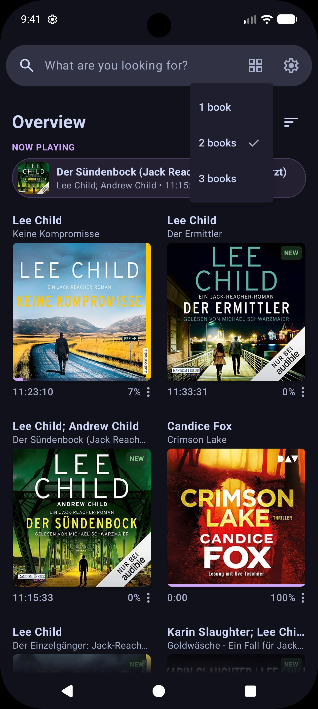
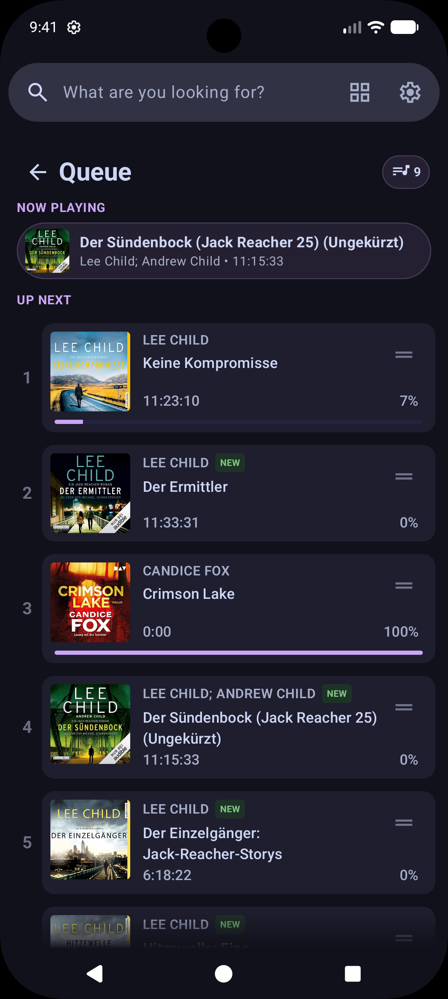
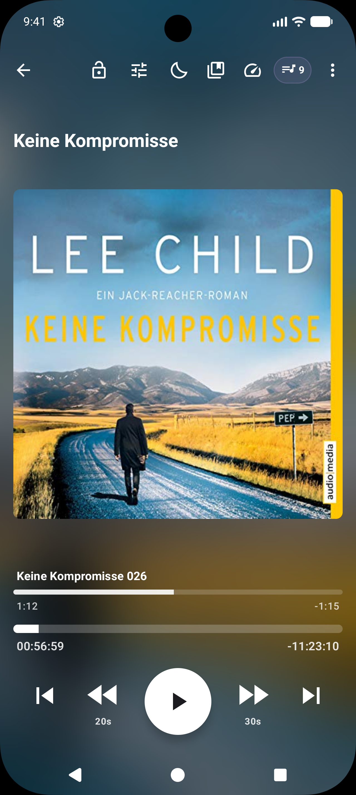
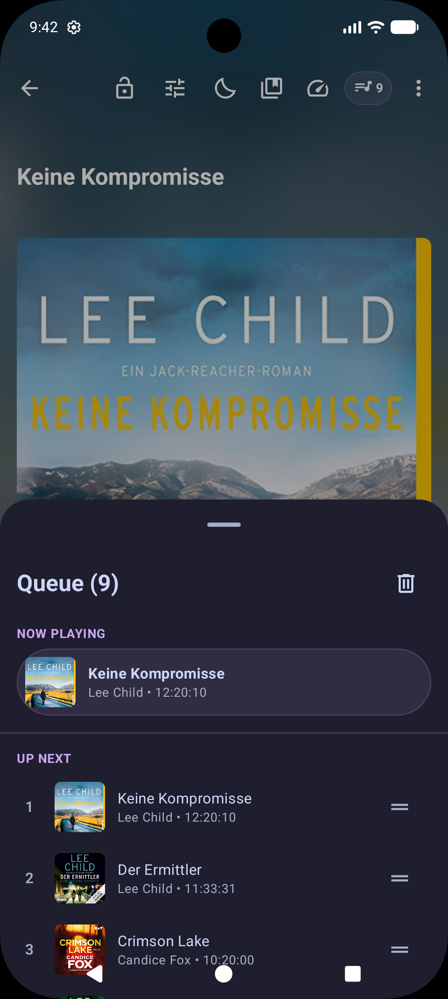
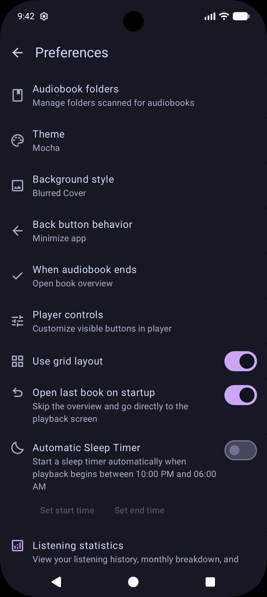
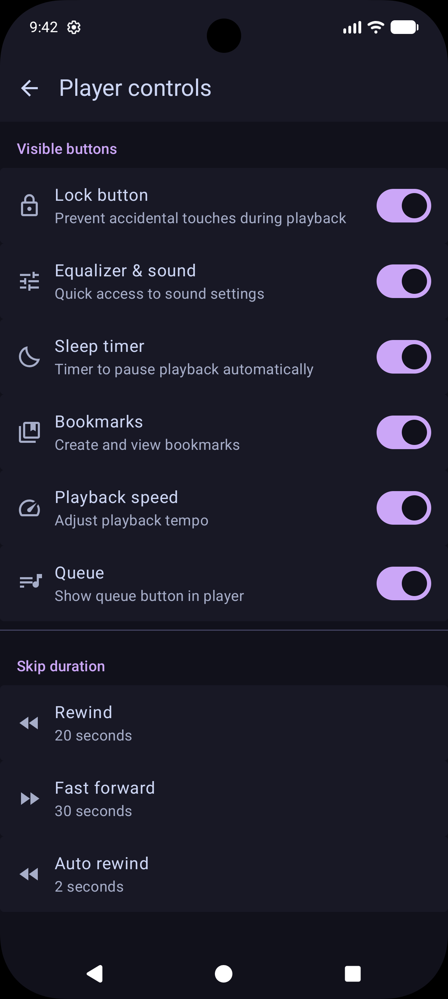
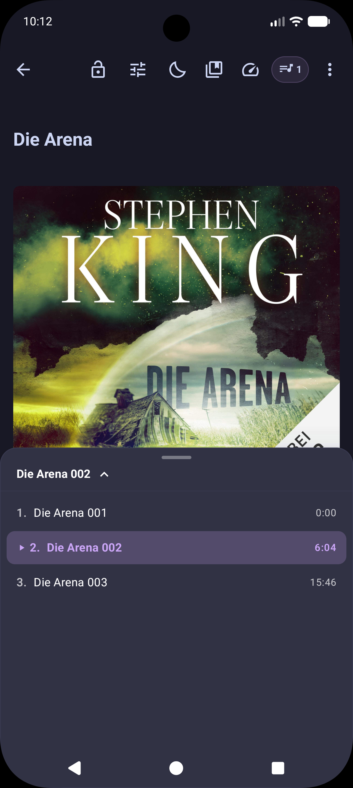

# Clio Audiobook Player

Clio is a clean, simple audiobook player for Android designed for listening to local audio files without clutter, tracking, or account requirements.

It started as a fork of [Voice](https://github.com/PaulWoitaschek/Voice) by Paul Woitaschek, refined with practical everyday features, a refreshed interface, and a focus on speed.

---

## Screenshots

  
  
  

  
  
  

  

---

## What's Different in Clio

Compared to the original Voice app, Clio brings several usability tweaks and quality-of-life additions:

### Player & Interface
- Playback lock: A dedicated lock button keeps the screen from reacting to accidental taps.
- Built-in equalizer: A 5-band equalizer with presets for spoken voice, bass boost, treble boost, and vocal clarity, as well as manual sliders.
- Cleaner navigation: Collapsible header arrows and organized popup menus instead of cluttered controls.
- Refreshed look: Modern Material You styling.
- Library indicators: Clear badges for newly added books and exact listening progress percentages across cards, chapters, and the main player.
Optional setting to jump straight into your last played audiobook when opening the app.
- Separate skip intervals: Set forward and rewind skip durations independently (for example, 30s forward, 10s backward).
- Flexible player backgrounds: Choose between blurred cover art, dynamic theme colors, or plain dark backgrounds.

### Under the Hood
- Fast startup: Optimized launch time so the player opens instantly.
- Faster scanning: Quicker folder imports and smoother indexing for large libraries.
- Private and offline: No tracking, analytics, ads, or internet permissions required.
- Full translations: Complete German and English localization throughout all menus and dialogs.

---

## Downloads

Download the latest version directly from GitHub Releases:
- [Clio Audiobook Player v1.0.3 (APK)](https://github.com/mryx007/clio-audiobook-player/releases/download/v1.0.3/Clio-Audiobook-Player-v1.0.3.apk)
- [All Releases](https://github.com/mryx007/clio-audiobook-player/releases)

## Credits & Acknowledgements

Clio Audiobook Player is based on the open-source player [Voice](https://github.com/PaulWoitaschek/Voice) created by **Paul Woitaschek**.
All original work is licensed under the **GNU General Public License v3.0 (GPLv3)**.

---

## Translations

Translations are managed via [Weblate](https://hosted.weblate.org/). If you would like to contribute, please check the Weblate project page.

---

## License

This project is licensed under the [GNU General Public License v3.0](LICENSE).

